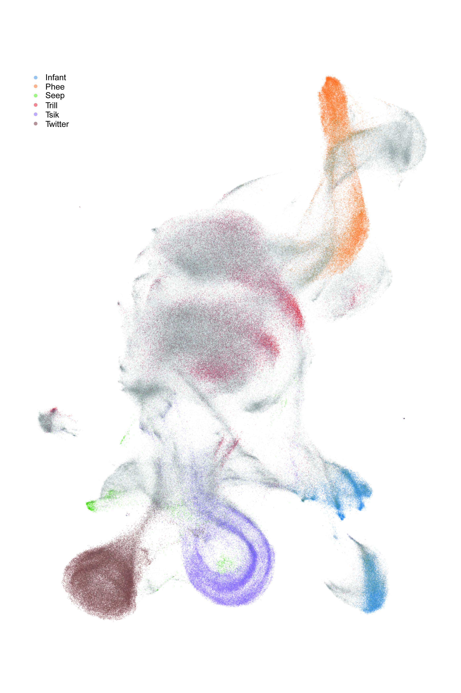
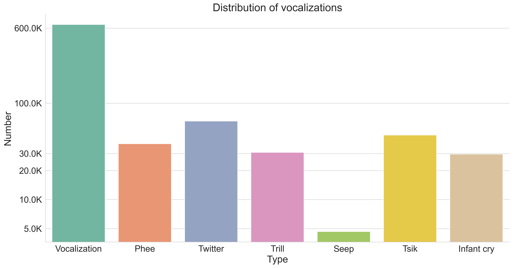
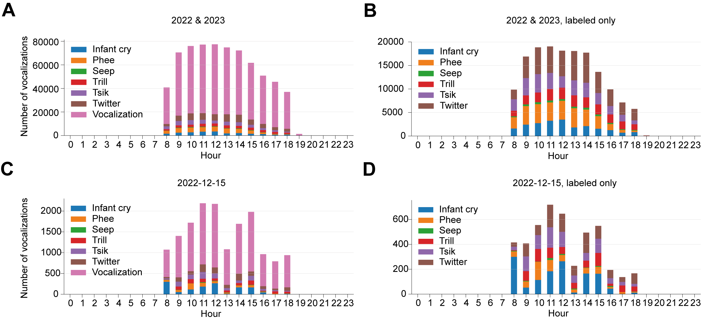
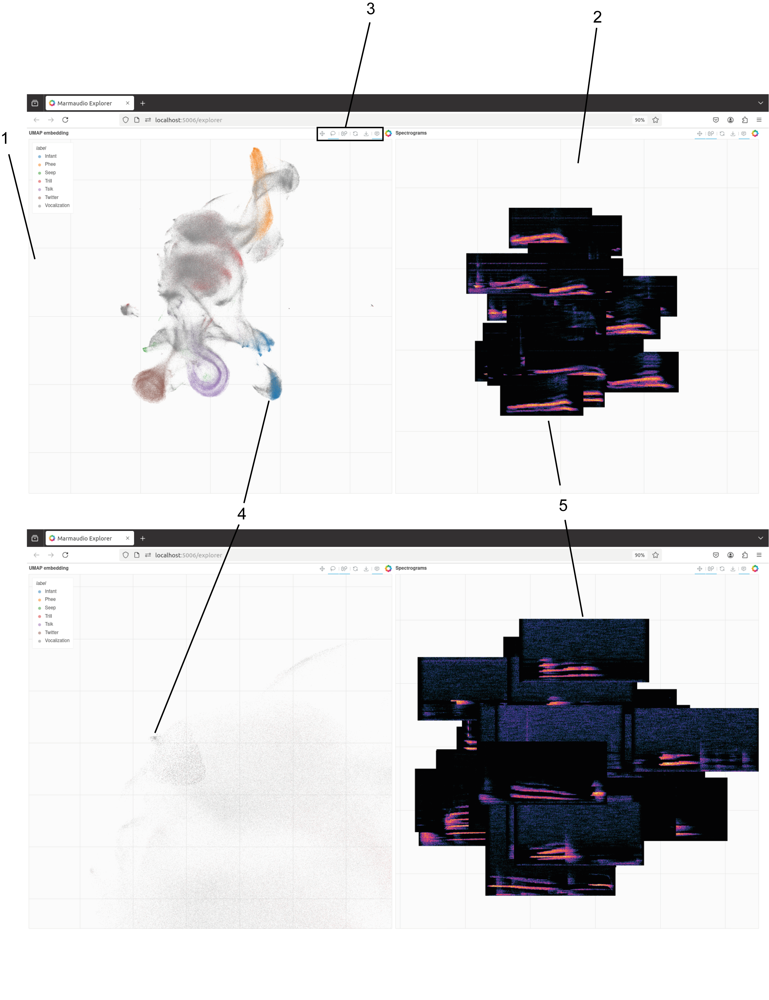
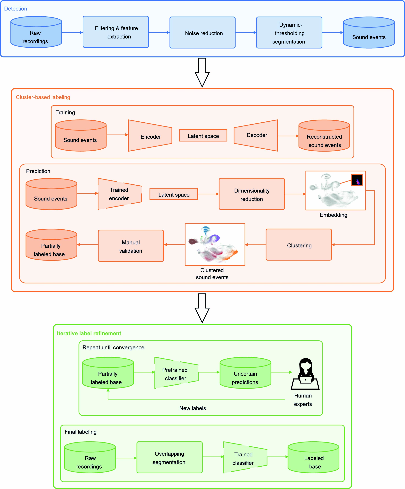
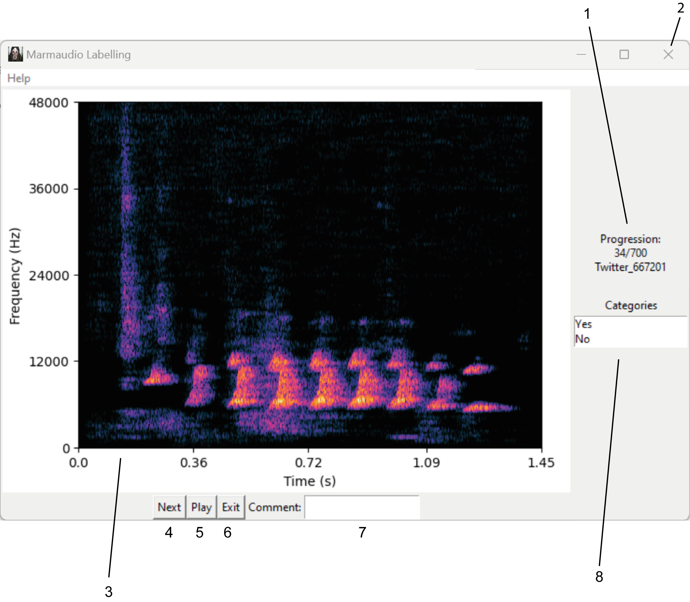

# MarmAudio: A large annotated dataset of vocalizations by common marmosets

This repository contains the code used for building MarmAudio (1), a marmoset vocalization dataset available on Zenodo (2). It includes scripts for data preprocessing, vocalization detection, and classification using a pre-trained deep learning model.

MarmAudio, a database of common marmoset vocalizations, which were continuously recorded with a sampling rate of 96 kHz from a stabulation room housing simultaneously ~20 marmosets in three cages. The dataset comprises more than 800,000 files, amounting to 253 hours of data collected over 40 months. Each recording lasts a few seconds and captures the marmosets' social vocalizations, encompassing their entire known vocal repertoire during the experimental period. Around 215,000 calls are annotated with the vocalization type.

The dataset can be downloaded here: https://zenodo.org/records/15017207

Legend: For each segmented vocalization, we computed a spectrotemporal representation. Using the trained encoder, we transformed these representations into a 16-dimensional space. From there, we employed the UMAP technique to map the data into latent feature spaces. The colored points denote the predictions where the classifier assigned a high confidence score.

## Distribution of vocalizations

Legend: Distribution over call type of 871,044 vocalizations.

## Daily distributions of vocalizations

One application could be to evaluate the colony's state by monitoring the daily distribution of the vocalization types.

Legend: The recordings were mostly done between 8 AM and 6 PM. A. Vocalization hourly distribution for 2022 & 2023, including unlabeled vocalizations. B. Same as in A., with only labeled vocalizations. C. Daily vocalizations produced on an exemplary day, including unlabeled vocalizations. D. Same as in C., with only labeled vocalizations.

## *Marmaudio Explorer*, an interactive visualization interface of the low-dimensional projection of the vocalizations

To allow users to investigate the dataset further and visualize the call types' relationships, we developed Marmaudio Explorer, an interactive visualization interface of the low-dimensional projection of the vocalizations. It allows users to select a group of points, which makes the spectrograms of the corresponding vocalizations appear on the Spectrograms panel, and saves the selected metadata and spectrogram images in a new folder, allowing for deep investigation.

Legend: (1) UMAP embedding panel. Each point is the coordinates in UMAP embedding of the autoencoder’s latent space of a segmented vocalization. The points could be selected using the Lasso Select in the Tools panel. (2) Spectrograms panel. The spectrograms of the vocalizations corresponding to the selected points appear at the corresponding location. (3) Tools panel. From left to right: Pan, Lasso Select, Wheel Zoom, Reset, Save, Hover. Pan permits navigation in the interface. Lasso Select permits the selection of a group of points. Each time points are selected, the spectrograms of the corresponding vocalizations appear on the Spectrograms panel, and the selections’ metadata and spectrograms’ images are saved in a new folder, allowing deep investigation. Wheel Zoom allows the user to zoom in/out. Reset gets back to the original state. Save takes a screenshot of the current state. Hover shows the name of the hovered points. (4) Two examples of selected points and (5) the corresponding spectrograms.

### Usage:

- Download the dataset
- Adjust the paths src/marmaudio/explorer.py
- `bokeh serve src/marmaudio/explorer.py`

## Pipeline for creating the dataset

Legend: The Detection phase aims to provide a first pool of segmented vocalizations to start the Cluster-based labeling phase. Later in the process, in the Iterative label refinement phase, all of the raw recordings are passed to the trained classifier.

## Vocalization labeling graphical user interface

Legend: The annotator was presented with 700 randomly sampled vocalizations. (1) Ongoing annotation number, name and id of the vocalization, labeled by the trained classifier. (2 and 6) The exit buttons of the interface save the ongoing labialization. (3) The spectrogram of the current vocalization. In this example, the model predicted a Twitter, and the annotator has to reply Yes or No (8) before passing to the next vocalization (4). The annotator can play the vocalization (5) and optionally add a comment (7).

## References

(1) Lamothe, C., Obliger-Debouche, et al. A large annotated dataset of vocalizations by common marmosets. Sci Data 12, 782 (2025). https://doi.org/10.1038/s41597-025-04951-8
(2) Lamothe, C., Obliger-Debouche, M., Best, P., Trapeau, R., Ravel, S., Artières, T., Marxer, R. & Belin, P. Zenodo 10.5281/zenodo.10997563 (2024).
